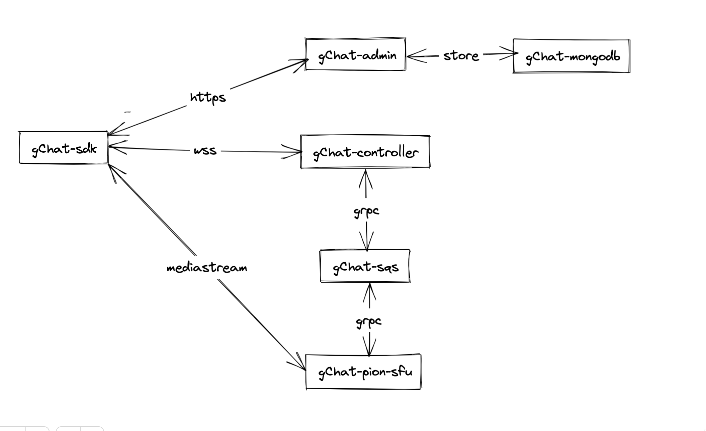

# Glanger-Chat
this project is to sorting my webRTC knowledge and practise my GoLang ability.
## architecture 

## directory structure
1. gChat-sdk(js) connect to gChat-controller
2. gChat-admin(feathers.js) admin token,room,user
3. gChat-controller(feathers.js) deal with the  wss,amazon sqs
4. gChat-sqs amazon sqs to publish,subscribe message queue 
5. gChat-pion-sfu(goLang with pion) deal with the media stream to the room user
6. gChat-dynamicdb amazon dynamicdb to store data

## still on thinking about it, not started.